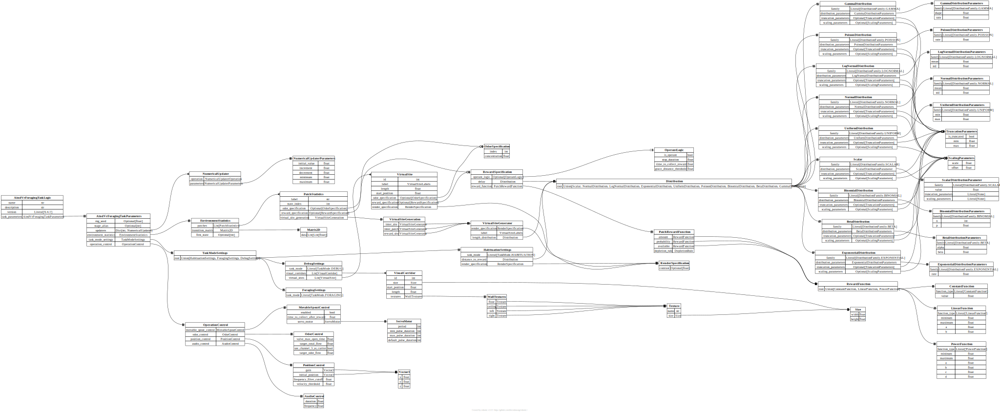

# Task Logic

## Base Classes

::: aind_behavior_vr_foraging.task_logic._BlockEndConditionBase
    options:
      filters: []

::: aind_behavior_vr_foraging.task_logic._OdorSpecification
    options:
      filters: []

::: aind_behavior_vr_foraging.task_logic._PatchTerminator
    options:
      filters: []

::: aind_behavior_vr_foraging.task_logic._PatchUpdateFunction
    options:
      filters: []

::: aind_behavior_vr_foraging.task_logic._RewardFunction
    options:
      filters: []

## Classes

::: aind_behavior_vr_foraging.task_logic.AindVrForagingTaskLogic

::: aind_behavior_vr_foraging.task_logic.AindVrForagingTaskParameters

::: aind_behavior_vr_foraging.task_logic.AudioControl

::: aind_behavior_vr_foraging.task_logic.Block

::: aind_behavior_vr_foraging.task_logic.BlockEndConditionChoice

::: aind_behavior_vr_foraging.task_logic.BlockEndConditionDistance

::: aind_behavior_vr_foraging.task_logic.BlockEndConditionDuration

::: aind_behavior_vr_foraging.task_logic.BlockEndConditionPatchCount

::: aind_behavior_vr_foraging.task_logic.BlockEndConditionReward

::: aind_behavior_vr_foraging.task_logic.BlockStructure

::: aind_behavior_vr_foraging.task_logic.ClampedMultiplicativeRateFunction

::: aind_behavior_vr_foraging.task_logic.ClampedRateFunction

::: aind_behavior_vr_foraging.task_logic.CtcmFunction

::: aind_behavior_vr_foraging.task_logic.EnvironmentStatistics

::: aind_behavior_vr_foraging.task_logic.LookupTableFunction

::: aind_behavior_vr_foraging.task_logic.MovableSpoutControl

::: aind_behavior_vr_foraging.task_logic.NumericalUpdater

::: aind_behavior_vr_foraging.task_logic.NumericalUpdaterOperation

::: aind_behavior_vr_foraging.task_logic.NumericalUpdaterParameters

::: aind_behavior_vr_foraging.task_logic.OdorControl

::: aind_behavior_vr_foraging.task_logic.OnThisPatchEntryRewardFunction

::: aind_behavior_vr_foraging.task_logic.OperantLogic

::: aind_behavior_vr_foraging.task_logic.OperationControl

::: aind_behavior_vr_foraging.task_logic.OutsideRewardFunction

::: aind_behavior_vr_foraging.task_logic.Patch

::: aind_behavior_vr_foraging.task_logic.PatchRewardFunction

::: aind_behavior_vr_foraging.task_logic.PatchTerminatorOnChoice

::: aind_behavior_vr_foraging.task_logic.PatchTerminatorOnDistance

::: aind_behavior_vr_foraging.task_logic.PatchTerminatorOnRejection

::: aind_behavior_vr_foraging.task_logic.PatchTerminatorOnReward

::: aind_behavior_vr_foraging.task_logic.PatchTerminatorOnRewardSite

::: aind_behavior_vr_foraging.task_logic.PatchTerminatorOnTime

::: aind_behavior_vr_foraging.task_logic.PatchVirtualSitesGenerator

::: aind_behavior_vr_foraging.task_logic.PersistentRewardFunction

::: aind_behavior_vr_foraging.task_logic.PositionControl

::: aind_behavior_vr_foraging.task_logic.RenderSpecification

::: aind_behavior_vr_foraging.task_logic.RewardFunctionRule

::: aind_behavior_vr_foraging.task_logic.RewardSpecification

::: aind_behavior_vr_foraging.task_logic.SetValueFunction

::: aind_behavior_vr_foraging.task_logic.Texture

::: aind_behavior_vr_foraging.task_logic.TreadmillSpecification

::: aind_behavior_vr_foraging.task_logic.UpdaterTarget

::: aind_behavior_vr_foraging.task_logic.VirtualSite

::: aind_behavior_vr_foraging.task_logic.VirtualSiteGenerator

::: aind_behavior_vr_foraging.task_logic.VirtualSiteLabels

::: aind_behavior_vr_foraging.task_logic.VirtualSiteRewardSpecification

::: aind_behavior_vr_foraging.task_logic.VisualCorridor

::: aind_behavior_vr_foraging.task_logic.WallTextures
